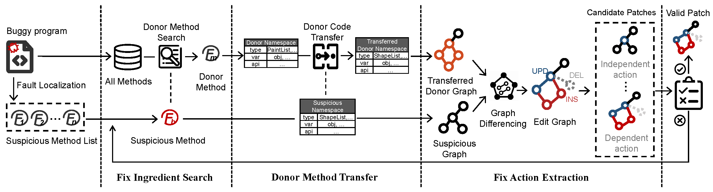

#  TransplantFix: Graph Differencing-based Code Transplantation for Automated Program Repair

- [TransplantFix: Graph Differencing-based Code Transplantation for Automated Program Repair](#transplantfix-graph-differencing-based-code-transplantation-for-automated-program-repair)
  - [1. TransplantFix Framework](#1-transplantfix-framework)
  - [2. Reproduction](#2-reproduction)
    - [2.1. Environment](#21-environment)
    - [2.2. Configuration](#22-configuration)
    - [2.3. Packaging](#23-packaging)
    - [2.4. Execution](#24-execution)
  - [3. Structure](#3-structure)
  - [4. Literature Review](#4-literature-review)
  - [5. LICENSE](#5-license)

This repository consists of all relevant artifacts of TransplantFix.

## TODO List

+ Integration into [Repairnator](https://github.com/eclipse/repairnator)
  (https://github.com/eclipse/repairnator/issues/1257)
+ Improve Transplantfix to better assist in real-world manual debugging.

## 1. TransplantFix Framework

The framework of TransplantFix is presented as follows:



**We aim to contribute a novel APR technique that leverages graph differencing-based code transplantation to the APR community. We release the complete source code TransplantFix that covers the whole automated program repair pipeline, including [fault localization](./fl_modules/fault_localizer), [patch generation](./apr_tools/Transplantfix), [patch validation](./patch_validator/patch_validator). We hope the publicly available implementation could facilitate follow-up research towards conquering more complicated/new real-world bugs.** 

## 2. Reproduction

### 2.1. Environment

The implementation and evaluation of TransplantFix are performed with:

- OS: Ubuntu 16.04
- JDK: JDK 7 (for Defects4J v1.2) and JDK 8 (for Defects4J v2.0)
- Python 3 (with Conda environment)
- Maven 3
  
### 2.2. Configuration

1) To configure Defects4J v1.2:

```shell
cd datasets/
git clone https://github.com/rjust/defects4j.git defects4j
cd defects4j
git checkout v1.4.0
./init.sh
```

2) To configure Defects4J v2.0:

```shell
cd datasets/
git clone https://github.com/rjust/defects4j.git defects4j2
cd defects4j2
git checkout v2.0.0
./init.sh
```

### 2.3. Packaging

To package projects of fault localization, patch generation (i.e., the core module of TransplantFix), and patch validation:

```shell
cd apr_tools/Transplantfix && ./package.sh
cd fl_modules/fault_localizer/package.sh && ./package.sh
cd patch_validator/patch_validator/package.sh && ./package.sh
```

### 2.4. Execution

To run TransplantFix on Defects4J v1.2 and v2.0:

```shell
cd Runner
export PYTHONPATH=./dataset:./apr:./localization:${PYTHONPATH} 
python ./Run_bugs_d4jv1.py

python ./Run_bugs_d4jv2.py
```

## 3. Structure

```yaml
├── apr_tools
│   └── Transplantfix:    source code and build scripts of TransplantFix 
├── datasets
│   ├── dataset_info:     necessary information to run defects4j v1.2 and v2.0 bugs, e.g., classpath
├── doc
│   └── figs:             figure of TranplantFix framework
├── fl_modules
│   └── fault_localizer:  source code and build scripts of our fault localizer 
├── LICENSE:              license
├── literature_review
│   └── literature_review_on_42_apr_tools.xlsx: literature review data of 42 APR tools
├── patches
│   ├── defects4j:        patches generated by TranplantFix for Defects4J v1.2 bugs
│   └── defects4j2:       patches generated by TranplantFix for Defects4J v2.0 bugs
├── patch_validator
│   └── patch_validator:  source code and build scripts of our patch validator
├── README.md
└── Runner:               scripts for running TranplantFix on Defects4J v1.2 and v2.0
```

P.S. The list of 395 bugs in Defects4J v1.2 is available at [Runner/bugs_info/defects4j.txt](./Runner/bugs_info/defects4j.txt), and the list of 444 new bugs in Defects4J v2.0 is available at [Runner/bugs_info/defects4j2_uniq.txt](./Runner/bugs_info/defects4j2_uniq.txt).

## 4. Literature Review

Apart from the literature review data available at [literature review](./literature_review), we further present the detail of each APR tool, including its publicly available repository, publication title, etc. We aim to present a comprehensive review to the APR community.

| ID | APR Tool | Year | Publicly Available Repository | Publication | Venue |
|---|---|---|---|---|---|
| 1 | Nopol | 2016 | https://github.com/SpoonLabs/nopol/ | Nopol: Automatic repair of conditional statement bugs in java programs | TSE |
| 2 | jKali | 2016 | https://github.com/Spirals-Team/defects4j-repair/ | Astor: A program repair library for java | ISSTA |
| 3 | jMutRepair | 2016 | https://github.com/SpoonLabs/astor/experiments/ | Astor: A program repair library for java | ISSTA |
| 4 | jGenProg | 2016 | https://github.com/Spirals/Team/defects4j/repair/ | Astor: A program repair library for java | ISSTA |
| 5 | HDRepair | 2016 | https://github.com/xuanbachle/bugfixes | History driven program repair | SANER |
| 6 | DynaMoth | 2016 | https://github.com/SpoonLabs/nopol/ | Dynamoth: dynamic code synthesis for automatic program repair | Proceedings of the 11th International Workshop on Automation of Software Test |
| 7 | JAID | 2017 | https://bitbucket.org/maxpei/jaid/wiki/Home | Contract-based Program Repair Without the Contracts | ASE |
| 8 | ACS | 2017 | https://github.com/Adobee/ACS | Precise condition synthesis for program repair | ICSE |
| 9 | ssFix | 2017 | https://github.com/qixin5/ssFix | Leveraging syntax-related code for automated program repair | ASE |
| 10 | ELIXIR | 2017 | - | Elixir: Effective object-oriented program repair | ASE |
| 11 | Cardumen | 2018 | https://github.com/SpoonLabs/astor-experiments/ | Ultra-large repair search space with automatically mined templates: The cardumen mode of astor | International Symposium on Search Based Software Engineering（SBSE） |
| 12 | ARJA | 2018 | https://github.com/yyxhdy/arja | ARJA: Automated repair of java programs via multi-objective genetic programming | TSE |
| 13 | LSRepair | 2018 | https://github.com/AutoProRepair/LSRepair | LSRepair: Live search of fix ingredients for automated program repair | APSEC |
| 14 | SketchFix | 2018 | https://github.com/SketchFix/SketchFix | Towards practical program repair with on-demand candidate generation | ICSE |
| 15 | CapGen | 2018 | https://github.com/justinwm/CapGen | Context-aware patch generation for better automated program repair | ICSE |
| 16 | SOFix | 2018 | - | Mining stackoverflow for program repair | SANER |
| 17 | SimFix | 2018 | https://github.com/xgdsmileboy/SimFix | Shaping program repair space with existing patches and similar code | ISSTA |
| 18 | GenProg-A | 2018 | https://github.com/yyxhdy/arja | ARJA: Automated repair of java programs via multi-objective genetic programming | TSE |
| 19 | RSRepair-A | 2018 | https://github.com/yyxhdy/arja | ARJA: Automated repair of java programs via multi-objective genetic programming | TSE |
| 20 | Kali-A | 2018 | https://github.com/yyxhdy/arja | ARJA: Automated repair of java programs via multi-objective genetic programming | TSE |
| 21 | VFix | 2019 | - | VFix: value-flow-guided precise program repair for null pointer dereferences | ICSE |
| 22 | SEQUENCER | 2019 | https://github.com/kth/sequencer | Sequencer: Sequence-to-sequence learning for end-to-end program repair | TSE |
| 23 | GenPat | 2019 | https://github.com/xgdsmileboy/GenPat | Inferring program transformations from singular examples via big code | ASE |
| 24 | kPAR | 2019 | https://github.com/SerVal-DTF/FL-VS-APR | You cannot fix what you cannot find! an investigation of fault localization bias in benchmarking automated program repair systems | ICST |
| 25 | iFixR | 2019 | - | iFixR: bug report driven program repair | ESEC/FSE |
| 26 | ConFix | 2019 | https://github.com/thwak/ConFix | Automatic patch generation with context-based change application | EMSE |
| 27 | AVATAR | 2019 | https://github.com/SerVal-Repair/AVATAR | Avatar: Fixing semantic bugs with fix patterns of static analysis violations | SANER |
| 28 | Tbar | 2019 | https://github.com/SerVal-DTF/TBar | TBar: revisiting template-based automated program repair | ISSTA |
| 29 | PraPR | 2019 | https://github.com/prapr/prapr | Practical program repair via bytecode mutation | ISSTA |
| 30 | HERCULES | 2019 | - | Harnessing evolution for multi-hunk program repair | ICSE |
| 31 | DeepRepair | 2019 | https://github.com/SpoonLabs/astor-experiments/ | Sorting and Transforming Program Repair Ingredients via Deep Learning Code Similarities | SANER |
| 32 | FixMiner | 2020 | https://github.com/SerVal-DTF/fixminer-core | Fixminer: Mining relevant fix patterns for automated program repair | EMSE |
| 33 | CODIT | 2020 | - | Codit: Code editing with tree-based neural models | TSE |
| 34 | DLFix | 2020 | https://github.com/ICSE-2019-AUTOFIX/ICSE-2019-AUTOFIX | DLFix: Context-based Code Transformation Learning for Automated Program Repair | ICSE |
| 35 | ARJA-e | 2020 | https://github.com/yyxhdy/arja/tree/arja-e | Toward better evolutionary program repair: An integrated approach | TOSEM |
| 36 | RESTORE | 2020 | - | Restore: Retrospective fault localization enhancing automated program repair | TSE |
| 37 | CoCoNuT | 2020 | https://github.com/lin-tan/CoCoNut-Artifact | CoCoNuT: combining context-aware neural translation models using ensemble for program repair | ISSTA |
| 38 | JAID-revise | 2020 | https://bitbucket.org/maxpei/jaid | Contract-based program repair without the contracts: An extended study | TSE |
| 39 | CURE | 2021 | https://github.com/lin-tan/CURE | CURE: Code-Aware Neural Machine Translation for Automatic Program Repair | ICSE |
| 40 | VarFix | 2021 | https://chupanw.github.io/varfix-supplement/ | VarFix: Balancing Edit Expressiveness and Search Effectiveness in Automated Program Repair | ESEC/FSE |
| 41 | Recoder | 2021 | https://github.com/pkuzqh/Recoder | A syntax-guided edit decoder for neural program repair | ESEC/FSE |
| 42 | RewardRepair | 2022 | https://anonymous.4open.science/r/RewardRepair/README.md | Neural Program Repair with Execution-based Backpropagation | ICSE |


## 5. LICENSE

The repository is licensed under the [GNU GPLv3 license](https://www.gnu.org/licenses/gpl-3.0-standalone.html). See [LICENSE](./LICENSE) for details.
